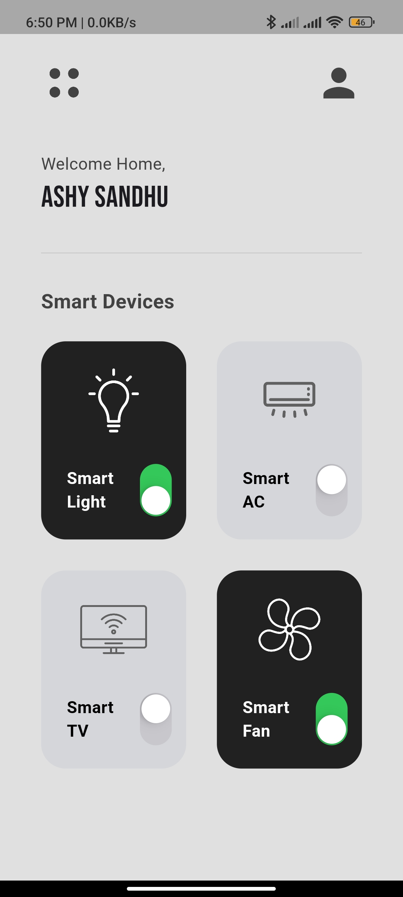

# Homora - Your Smart Home Companion

## Introduction

Homora is a Flutter-based mobile app that enables users to easily control and manage smart home devices through a clean and intuitive interface, streamlining everyday smart living.

## App Screenshot

Below are some glimpses of the Homora application, showcasing its user interface from the splash screen to the main device control dashboard. These screenshots highlight the app's design and user experience.

<!--suppress CheckImageSize -->





## What's inside

Homora is built with a focus on core smart home control features and a user-friendly interface.

- **Screens & Features:**
    - **Splash Screen:** An engaging entry point to the application, featuring an animated logo and app name ("HomeSync") that transitions smoothly to the main interface.
    - **Home Dashboard:** The central hub for managing smart devices. It greets the user and displays a grid of connected devices.
        - **Device Grid:** A clear and accessible grid layout showcasing various smart devices such as lights, air conditioners, TVs, and fans.
        - **Device Control:** Each device in the grid features a toggle switch, allowing users to easily turn them on or off.
        - **Navigation Icons:** Includes a menu icon and a user profile icon in the app bar for potential future navigation or settings access.

- **Key UI/UX Elements:**
    - **Clean Design:** A minimalist and clean user interface, with a focus on ease of use.
    - **Google Fonts:** Utilizes Google Fonts (Poppins and Bebas Neue) for clear and stylish typography.
    - **Custom Icons:** Employs custom icons for different smart devices (e.g., light bulb, AC, TV, fan) and UI elements (menu).
    - **Responsive Layout:** Designed to present information clearly on mobile screens.

- **Backend & Services:**
    - **Local Application:** Currently, Homora operates as a standalone local application.

## Installation

To get Homora up and running on your local development environment, follow these steps:

**Step 1:**

Clone this repository to your local machine (or download the source code).

```
git clone https://github.com/ashy-sandhu/homora.git
```

**Step 2:**

Ensure you have Flutter installed on your system. You can find the installation guide on the official Flutter website: [Flutter installation guide](https://docs.flutter.dev/get-started/install).

**Step 3:**

Navigate to the project's root directory in your terminal:

```sh
cd path/to/homora
```

**Step 4:**

Fetch the project dependencies by running the following command:

```sh
flutter pub get
```

**Step 5:**

Once the dependencies are installed, you can run the application on a connected device or emulator:

```sh
flutter run
```

## About the Author

Qurio is Developed by [Ahsan Malik/Code Harbor].

*   GitHub: [https://github.com/ashy-sandhu]
*   LinkedIn: [www.linkedin.com/in/ahsan-malik-2990722b9]

## Thanks To

This project utilizes several open-source packages and resources. Special thanks to:

*   The Flutter framework by Google.
*   `google_fonts` for beautiful typography.
*   Other dependencies listed in `pubspec.yaml`.

## License

Homora is under MIT License.
